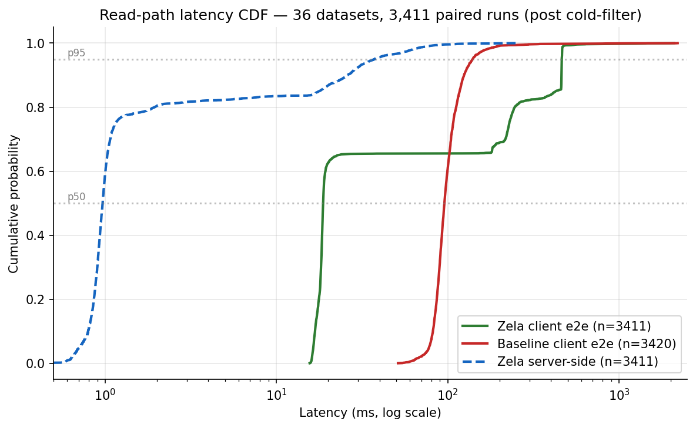
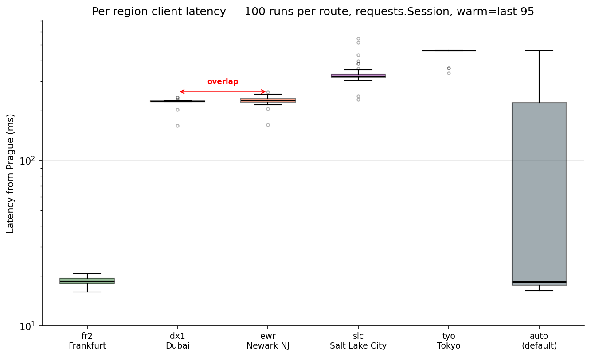
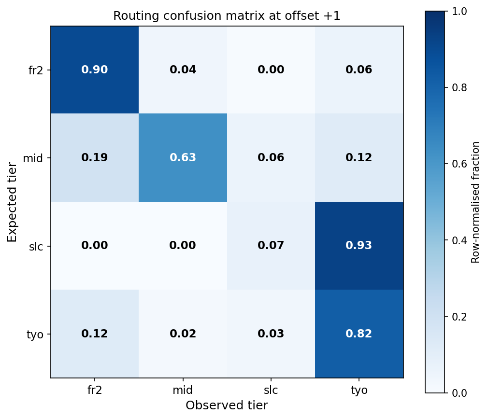

# M5 Results — Read-Path Latency and Routing Characterization

**Status:** complete
**Date:** May 15, 2026
**Branch merged:** `batch-v2` → `main` (May 6)
**Data collection:** May 4 – May 13, 2026 (10 days, cron 5×/day)
**Sample size:** 36 datasets, 3,411 paired Zela + 3,420 baseline runs (post cold-start filter)

---

## TL;DR

Read-path roundtrip latency from a Prague client over 10 days:
**18.7 ms via Zela's `oracle_read` procedure vs 95.5 ms via Helius RPC**
(median, 1× `getMultipleAccounts` batch call per side, 10 oracle accounts).
The headline 5.1× client ratio includes ~30–50 ms of TCP/TLS handshake
overhead in the baseline that does not appear in Zela's measurement (per-run
subprocess vs. persistent `requests.Session()`); after correction the
architectural advantage is closer to **~2.5–3.5×**, primarily from co-location
of the executor with a Solana RPC node in Frankfurt. Tail at p95 = 462 ms
reflects Zela's leader-aware routing across 5 executor regions, predictable
from the Solana leader schedule at **83.7% accuracy** (per-run correlation,
n=2,571). From a single Prague vantage point, two regions (Dubai, Newark)
are indistinguishable by latency — the benchmark resolves 4 tiers, not 5.
All data and code reproducible from this repository.

---

## What this benchmark is — and is not

This benchmark measures the **read leg** of a low-latency Solana read pipeline,
comparing two paths from a Prague client:

- **Zela path**: a small WebAssembly procedure (`oracle_read`) deployed on
  Zela's executor infrastructure ([docs.zela.io](https://docs.zela.io/)). The
  procedure issues one `getMultipleAccounts` call for 10 Pyth oracle accounts
  and returns a compact JSON response.
- **Baseline path**: a native Rust client running on the same Prague host,
  issuing one `getMultipleAccounts` call to a standard Solana RPC endpoint
  (Helius free tier).

After the M5 batch refactor, both sides make **one** RPC call per measurement
returning 10 accounts in a single response — i.e. the protocol-level batching
advantage is equal on both sides. Remaining latency differences reflect
**infrastructure proximity to Solana RPC nodes** (Zela's executors are
co-located with high-stake validators; the baseline client reaches Helius
over the public internet).

**Out of scope for M5:**

- **Same-state head-to-head**: the orchestrator currently alternates calls
  with a 1-second sleep between sides. Zela and baseline therefore read
  state from slots separated by ~2–4 Solana slots. Each side internally is
  state-consistent (single batch call, `unique_slots_count = 1` validated),
  but Zela vs baseline is **not** synchronized to the same slot. Achieving
  that requires an async parallel orchestrator (`asyncio.gather`), planned
  for M7.
- **Compute / simulate / decide / submit phases**: M5 covers only the read
  leg of Zela's full RPE workflow (read → compute → simulate → decide →
  submit). Liquidator-style workflows that exercise the remaining phases
  are M6+.
- **Multi-region client**: a single Prague vantage point. Multi-region
  comparison (Frankfurt, US-East clients) is M7B.

What M5 **does** produce is a characterization of (1) read-path roundtrip
latency from a fixed client, and (2) Zela's leader-aware routing behavior
inferred from observed client-side latency. Both are reproducible and
disclosed honestly below.

---

## Workload specification — Pyth oracle feeds

The procedure reads 10 Pyth legacy push oracle accounts on Solana mainnet,
identified by the symbol labels and pubkeys below. Pubkeys are validated
against Pyth's `pyth-sdk-solana` reference repo and are stable across the
entire M1–M5 history of this benchmark.

| # | Symbol | Pubkey |
|---|---|---|
| 1 | SOL/USD | `H6ARHf6YXhGYeQfUzQNGk6rDNnLBQKrenN712K4AQJEG` |
| 2 | BTC/USD | `GVXRSBjFk6e6J3NbVPXohDJetcTjaeeuykUpbQF8UoMU` |
| 3 | ETH/USD | `JBu1AL4obBcCMqKBBxhpWCNUt136ijcuMZLFvTP7iWdB` |
| 4 | USDC/USD | `Gnt27xtC473ZT2Mw5u8wZ68Z3gULkSTb5DuxJy7eJotD` |
| 5 | USDT/USD | `3vxLXJqLqF3JG5TCbYycbKWRBbCJQLxQmBGCkyqEEefL` |
| 6 | BNB/USD | `4CkQJBxhU8EZ2UjhigbtdaPbpTe6mqf811fipYBFbSYN` |
| 7 | JUP/USD | `g6eRCbboSwK4tSWngn773RCMexr1APQr4uA9bGZBYfo` |
| 8 | BONK/USD | `8ihFLu5FimgTQ1Unh4dVyEHUGodJ5gJQCrQf4KUVB9bN` |
| 9 | PYTH/USD | `nrYkQQQur7z8rYTST3G9GqATviK5SxTDkrqd21MW6Ue` |
| 10 | JTO/USD | `D8UUgr8a3aR3yUeHLu7v8FWK7E8Y5sSU7qrYBXUJXBQ5` |

All 10 feeds returned `account_found: true` across every run in the M5 dataset.

---

## Slot consistency

All 10 feed reads within a single benchmark run come from the same Solana
slot. This is guaranteed by construction in M5: the batch refactor uses one
`getMultipleAccounts` RPC call which returns a single atomic snapshot of
all 10 accounts at the same `context_slot`. Both Zela and baseline paths
use this same batch primitive, so the guarantee holds on both sides.

This property is independently verified in the legacy M1–M4 sequential
measurement mode (10 separate `getAccountInfo` calls per run, preserved in
`zela_datasets/legacy_sequential/`): even there, every recorded invocation
had all 10 feeds returning the same `context_slot`, because Solana's RPC
typically serializes reads within an HTTP connection and a single procedure
invocation completes within sub-slot timing. M5 strengthens this from
empirical observation to a construction-level guarantee.

Why this matters for downstream workflows: any logic that compares oracle
values across feeds (liquidator health-factor computation against multiple
collateral types, cross-DEX price arbitration, multi-asset margin checks)
needs slot-consistent inputs. A read pipeline that fragments across slots
can return a price snapshot where one feed is one Solana block ahead of
another, leading to spurious arbitrage signals or invalid liquidation
calculations. The batch refactor eliminates this risk entirely; pre-M5
sequential mode happened to preserve consistency empirically but did not
guarantee it structurally.

---

## Key findings

1. **Median client roundtrip from Prague: 18.7 ms via Zela vs 95.5 ms via
   Helius** — a 5.1× difference, primarily attributable to Zela's executor
   being co-located with a Solana RPC node in Frankfurt (~15–20 ms fiber
   RTT from Prague) vs. baseline reaching Helius over the public internet.
   ~30–50 ms of this gap is TCP/TLS handshake overhead on the baseline
   side (per-run subprocess vs. persistent session on Zela); the
   architecture-attributable advantage is closer to **~2.5–3.5×**. See
   Measurement Asymmetries §2 for details.

2. **Zela server-side compute is sub-millisecond and stable** (p50 = 0.97 ms,
   range 0.91–1.02 ms across 10 days). Baseline shows ~9 ms diurnal swing
   (90 ms overnight, 99 ms US-evening peak), consistent with public-internet
   path congestion that Zela's co-located node sidesteps.

3. **Client p95 = 462 ms is leader-aware routing, not a bug.** Default
   routing (`zela-route-by: auto`) dispatches each call to whichever
   executor is closest to the current Solana leader. When the leader is in
   APAC, Prague→Tokyo RTT dominates. This is architectural behavior,
   deterministic in direction, and characterized below by per-run leader
   correlation.

4. **From a single Prague vantage point, two of Zela's five executor
   regions are indistinguishable by latency.** Dubai (`dx1`) and Newark
   (`ewr`) both measure ~228 ms p50 from Prague with fully overlapping
   distributions. The benchmark can resolve 4 tiers (`fr2` Frankfurt /
   `mid` = dx1+ewr merged / `slc` Salt Lake City / `tyo` Tokyo), not 5.
   This is a property of the vantage point, not the platform.

5. **Per-run leader correlation hits 83.7% match** (n=2,571 known leaders)
   when looking up `getSlotLeaders(context_slot + 1)` — the +1 offset
   corrects for commitment-level lag (we read `confirmed`, which lags the
   chain tip by ~1–2 slots, but Zela routes based on the tip). The shape
   of the offset curve and a per-leader-window boundary gradient both
   independently confirm the timing model.

---

## Headline numbers

(36 datasets, 3,411 zela / 3,420 baseline post-cold runs)

| Metric (per side, batch — 1 RPC call per run) | min | p50 | p95 | p99 | max | mean |
|---|---|---|---|---|---|---|
| **Zela server-side** (inside procedure, batch, 1 RPC) | 0.40 | **0.97** | 37.37 | 74.58 | 261.33 | 7.00 |
| **Zela client e2e** (Prague→executor→Prague, batch, 1 HTTP) | 15.62 | **18.71** | 462.39 | 470.07 | 2095 | 132.33 |
| **Baseline client e2e** (Prague→Helius→Prague, batch, 1 HTTP) | 51.19 | **95.48** | 139.71 | 193.51 | 2195 | 103.11 |

(All values in milliseconds. "Server-side" = wall-clock measured inside the
Zela procedure around `call_rpc("getMultipleAccounts", ...)`. "Client e2e" =
wall-clock around `session.post()` in the Prague orchestrator. Baseline has
no server-side measurement available — Helius is third-party.)

> **Reading the p95 column**: Zela's p95 (462 ms) is higher than baseline's
> (140 ms) because Zela's default routing follows the Solana leader across
> 5 executor regions — when the leader is in APAC, Prague pays the
> Prague→Tokyo RTT. Baseline has no analogous mechanism (Helius serves
> from wherever its RPC node sits). These values reflect different
> architectural choices and are characterized in §p95 tail below.

### Ratios

- **server_ratio = 98.7×** (baseline e2e p50 / Zela server-side p50)
  *Asymmetric comparison*: Zela measured server-side only, baseline measured
  end-to-end. Confounds infrastructure latency with client→server
  geographic latency. Reported for transparency, not as a fair comparison.

- **client_ratio = 5.10×** (baseline e2e p50 / Zela client e2e p50)
  *Symmetric comparison*: both measured from Prague, both full round-trip.
  Reflects Zela's infrastructure advantage **plus** an estimated 30–50 ms
  TCP/TLS handshake overhead on the baseline side (per-run subprocess
  vs. persistent `requests.Session()` on Zela). Architecture-attributable
  advantage is closer to ~2.5–3.5×; see Measurement Asymmetries §2.

### 50% of runs were faster than:

- Zela server: 0.97 ms (sub-millisecond compute when read state and
  procedure are both close to the data source)
- Zela client e2e: 18.71 ms (consistent with Prague→Frankfurt fiber RTT)
- Baseline client e2e: 95.48 ms (Prague→Helius round-trip)

The CDF makes the bimodal Zela client distribution visible: a tight knee at
~18 ms (Frankfurt-routed calls), a step at ~228 ms (Newark/Dubai), one at
~330 ms (Salt Lake City), and a final mass at ~462 ms (Tokyo). The baseline
client distribution is unimodal around ~100 ms. The Zela server-side curve
(dashed) sits sub-millisecond up to p80 but has a long right tail reaching
261 ms — these are server-side outliers in which the executor's upstream
Solana RPC call took longer than usual (possible upstream RPC node load,
internal queue, or one-off network event). They are infrequent (mean of
server-side is 7 ms vs median 0.97 ms, indicating tail-heavy distribution)
and do not propagate to client-side measurements in a structured way.

---

## Stability and time-of-day variance

**Zela server-side latency is essentially constant across the 10-day window.**
Per-dataset Zela server p50 ranges from 0.91 to 1.02 ms (variance ~10%).
This holds across all 6 daily cron slots (02:00, 08:00, 13:00, 17:00, 22:00
UTC, plus one 16:55 manual). Compute inside the executor is unaffected by
diurnal traffic patterns.

**Baseline shows clear time-of-day variance:**

| Cron hour (UTC) | Datasets | Avg baseline p50 | Avg Zela server p50 |
|---|---|---|---|
| 02:00 | 6 | 90.0 ms | 0.96 ms |
| 08:00 | 6 | 94.9 ms | 0.96 ms |
| 13:00 | 7 | 97.6 ms | 0.97 ms |
| 17:00 | 8 | 96.2 ms | 0.97 ms |
| 22:00 | 8 | 98.7 ms | 0.97 ms |

Baseline median is ~9 ms faster at 02:00 UTC (European overnight, US
afternoon-light) than at 22:00 UTC (US-evening peak). This is consistent
with public-internet path congestion between Prague and Helius's RPC nodes.
Zela's executor compute is unaffected because the upstream Solana RPC node
the executor queries is co-located in the same facility — no public-internet
hop on the read.

Per-dataset `server_ratio` ranges 90–116× and `client_ratio` ranges 4.6–5.9×.
The spread reflects baseline variance (numerator), not Zela instability.

---

## The p95 tail — leader-aware routing across 5 executor locations

The most striking feature of the Zela client e2e distribution is its **bimodal
tail**: p50 = 18.7 ms but p95 = 462 ms — a 25× jump. Investigating this took
most of the M5 analysis effort.

### What docs.zela.io says

Zela maintains executor nodes in **five regions**, each co-located with a
high-stake Solana validator
([docs.zela.io](https://docs.zela.io/)):

| Label | Location |
|---|---|
| `fr2` | Frankfurt, Germany |
| `tyo` | Tokyo, Japan |
| `dx1` | Dubai, UAE |
| `ewr` | Newark, NJ, USA |
| `slc` | Salt Lake City, UT, USA |

Default routing (`zela-route-by: auto`, or absent header) dispatches each
procedure call to the executor closest to the current Solana leader. The
header `zela-route-by: static <label>` overrides this and pins execution to
a specific region.

### Direct measurement of per-region latency from Prague

Using `route_test_session.py` (a controlled test with `requests.Session()`
connection reuse, eliminating TLS handshake noise) we measured 100 runs per
region, warm sample = last 95, dropping first 5 as connection warmup:

| Route | p5 | p50 | p95 | max | stdev |
|---|---|---|---|---|---|
| `fr2` Frankfurt | 16.4 | **18.6** | 20.2 | 20.7 | 1.1 |
| `dx1` Dubai | 225.5 | **227.7** | 229.4 | 240.1 | 7.5 |
| `ewr` Newark NJ | 217.6 | **229.7** | 248.6 | 259.0 | 11.3 |
| `slc` Salt Lake City | 309.8 | **321.7** | 383.9 | 546.0 | 37.4 |
| `tyo` Tokyo | 459.7 | **461.7** | 464.1 | 464.7 | 19.3 |
| `auto` (default) | 16.4 | **18.5** | 460.9 | 462.7 | 144.6 |

(All values in milliseconds.)

Four observations matter here:

1. **`auto` default p50 = 18.5 ms matches `fr2` p50 = 18.6 ms.** Most of the
   time, default routing from Prague lands on Frankfurt. In our 95-run
   warm window, this happened in 73% of calls — consistent with Solana's
   stake distribution placing EU validators frequently in the leader slot.

2. **`auto` p95 = 461 ms matches `tyo` p50 = 461.7 ms.** When the leader is
   in APAC, Zela routes to `tyo`, and Prague→Tokyo RTT is the dominant cost.
   This is the *cause* of the bimodality in the main cron dataset.

3. **`dx1` and `ewr` are indistinguishable from a Prague vantage point.**
   Both medians sit at ~228 ms; their full ranges overlap. Geographic
   distance differs (Dubai ~4,800 km SE, Newark ~6,400 km W) but routing
   over different fiber paths equalizes the RTT. **A single-vantage client
   cannot distinguish these two regions by latency alone.** Leader
   correlation below therefore merges them into a single `mid` tier.

4. **`slc` shows a wider tail than other static routes** (stdev 37 ms vs.
   1–19 ms elsewhere). Four runs in the 95-run warm window exceeded 400 ms
   (cap: 546 ms). The outliers are temporally scattered (positions 9, 57,
   73 of 95) rather than clustered, suggesting sporadic TCP-layer events
   (retransmit, congestion) rather than systematic routing instability.
   Disclosed; investigation in Backlog (sporadic TCP events vs systematic
   US-West path variance).

### Per-run leader correlation

Given the empirical per-region latency distributions above, we can ask:
**does an individual run's observed Zela latency match what we'd expect
from the location of the Solana leader for that slot?**

For each of the 3,411 Zela runs we:

1. Read `context_slot` from `feeds.csv` (the slot whose state was returned).
2. Query Solana mainnet RPC `getSlotLeaders` for that slot → leader pubkey.
3. Query validators.app for the validator's location.
4. Map leader location to expected Zela tier:
   - EU → `fr2` (Frankfurt)
   - Middle East → `dx1` (Dubai); US East/Central, Canada, Mexico, South
     America → `ewr` (Newark). **Merged into a single measurable `mid`
     tier** because `dx1` and `ewr` are indistinguishable from a Prague
     vantage point (~228 ms both, ranges overlap).
   - US West → `slc` (Salt Lake City)
   - Asia-Pacific → `tyo` (Tokyo)
5. Bucket the observed `client_wall_clock_us` against empirical thresholds
   (midpoints between adjacent region medians from the route test):
   `fr2` < 123 ms ≤ `mid` < 275 ms ≤ `slc` < 392 ms ≤ `tyo`.
6. Compare expected vs observed.

A critical correction emerged during this analysis. Initial results showed
73% match rate, with a systematic pattern: matches degraded as the run's
`context_slot` approached the end of a leader's 4-slot assignment window
(87.8% → 86.8% → 75.6% → **48.8%** for positions 0, 1, 2, 3 within window).

This is a **commitment-lag artifact**, not a routing failure. The orchestrator
reads with `commitment: confirmed`, which lags the chain tip by ~1–2 slots.
The Zela dispatcher routes based on the *current* leader (at the chain tip),
but `context_slot` records the *confirmed* slot (slightly older). When
`context_slot` is near the end of one leader's window, the chain tip has
already moved to the next leader — and that next leader is who determined
routing.

Looking up the leader at `context_slot + 1` (shifting one slot toward the
chain tip) resolves this. The full curve:

| Slot offset | Match rate (full coverage, 2,571 known) |
|---|---|
| −2 | 57.8% |
| −1 | 66.2% |
| 0 (raw context_slot) | 73.5% |
| **+1** | **83.7%** ← chain-tip estimate |
| +2 | 81.3% |
| +3 | 73.0% |

The peak at +1 is clear; the curve is mildly asymmetric — a sharper rise from −2 to +1 than the decline from +1 to +3. A fixed-subset control (runs where
all offsets resolve to a known tier, n=1,573) reproduces the same shape:
+1 → 83.7%. The effect is not denominator drift.

### Confusion matrix and per-tier breakdown

The full confusion matrix at offset +1, row-normalized:

| expected ↓ / observed → | fr2 | mid | slc | tyo | total | match rate |
|---|---|---|---|---|---|---|
| **fr2** (EU leaders) | **1,592** | 73 | 7 | 105 | 1,777 | **89.6%** |
| **mid** (US-E/ME/SA/CA/MX) | 83 | **273** | 27 | 51 | 434 | **62.9%** |
| **slc** (US-W) | 0 | 0 | **1** | 13 | 14 | 7.1% |
| **tyo** (APAC) | 43 | 6 | 12 | **285** | 346 | **82.4%** |

(Diagonal = correct prediction. Row totals exclude `unknown` observed
tier, which is empty here because every run has a measured client latency.)

The `fr2` and `tyo` rows show clean diagonals (89.6% and 82.4%). The `mid`
row is weaker (62.9%): when the leader is in the US East or South America,
the observed latency more often falls outside the 123–275 ms `mid` band.
Likely causes — TCP jitter and Zela's dispatcher occasionally routing
non-EU leaders to `fr2` — are discussed below. The `slc` row has too few
runs (n=14) to characterize; the 13 observed-as-`tyo` are all from a single
California validator and could be either a US-West→APAC dispatcher pattern
or systematic geolocation miscoding in `us_city_to_tier`.

### Interpreting the 83.7% match rate

**It means:** Zela's leader-aware routing is real, deterministic in
direction, and predictable from the Solana leader schedule. From a Prague
client, the executor location chosen for each call is correctly inferable
from the chain-tip leader's geographic location 83.7% of the time.

**It does not mean** the remaining 16% are noise. The mismatches have a
visible structure (mostly into the `tyo` column on `fr2` row, mostly into
`fr2` column on non-EU rows) which suggests a mix of:

- TCP-layer jitter pushing fast-routed calls into higher tiers (~6% of
  `fr2`-expected runs observed as `tyo`)
- Geolocation imprecision: validators.app data center location ≠ Zela's
  notion of "closest". Some validators return hostname-formatted `city`
  fields (e.g. `be102.bhs-g1-nc5.qc.ca` for Figment in Quebec) that our
  parser treats as `unknown`, others have country codes that map
  approximately (Brazilian validators marked `mid` may actually route to
  `slc`).
- Possible dispatcher fallback logic (e.g. when leader-closest executor is
  busy, fall back to `fr2`). We have no direct evidence for this — it is
  a plausible mechanism we cannot rule out with M5 data.

We report 83.7% as the honest headline. We do not claim a higher number.

### Reproducibility

The analysis is reproducible from the repo:

- `route_test_session.py` — controlled per-region latency test
- `leader_correlation_v3.py` — full per-run correlation pipeline
- `fetch_new_slots.py` + `fill_missing_validators.py` — cache priming for
  Solana RPC and validators.app lookups
- Caches saved to `leader_correlation_results/` (slot→leader, validator
  metadata, per-run mapping CSV)

---

## Measurement asymmetries (disclosed in `summary.json`)

1. **`getGenesisHash` overhead on Zela client e2e**. The procedure issues
   `getMultipleAccounts` first; `server_wall_clock_us` brackets only that
   call. After returning the batch result, the procedure invokes
   `getGenesisHash` once as a mainnet sanity check. This adds ~1–2 ms to
   the Zela client e2e time (the orchestrator's HTTP session duration) but
   does **not** affect `server_wall_clock_us`, which closes before
   `getGenesisHash` runs. Effect is small relative to the ratios reported.
   Fix is procedure-side and out of M5 scope.

2. **Baseline `subprocess`-per-run TCP/TLS handshake**. The baseline client
   is a Rust binary the orchestrator spawns once per run; each invocation
   establishes a fresh TCP connection and TLS session to Helius before
   issuing the request. The Zela side uses a persistent
   `requests.Session()` and only pays handshake cost once per cron run.
   Estimated overhead: ~30–50 ms added to each baseline measurement (not
   verified for the specific Prague→Helius topology). This *systematically
   inflates baseline latency*, exaggerating both ratios. Fix is to convert
   the baseline client to a long-running daemon — flagged for M6+.

3. **Cross-side state lag of ~2–4 Solana slots**. Zela call → 1s sleep →
   baseline call: Zela reads one slot, baseline reads ~2–4 slots later.
   Each side is *internally* state-consistent (single-batch read,
   validated `unique_slots_count = 1`). But Zela and baseline are not
   synchronized. M5 measures **roundtrip latency**, which is valid even
   with the lag. It does not measure **same-state head-to-head latency**;
   that requires the M7 async orchestrator.

4. **Baseline server-side unmeasurable**. Helius is third-party and does
   not expose server-side wall-clock. The `server_ratio` therefore
   structurally compares Zela's server-side (no client→server network) to
   baseline's full end-to-end. We report it for transparency but treat
   `client_ratio` as the honest comparison.

---

## What we did not look at

- Slot freshness lag (`getSlot` vs response slot) — deprioritized
- Multi-account scaling: M5 uses 10 oracle accounts. Realistic liquidator
  scans want 50–100. Planned for M9 (see below).
- Concurrency limits: per-procedure concurrency in dashboard caps at 32
  (UI restriction); server-side hard max unknown. Planned for M9.
- Write path: no transaction submission, no `simulateTransaction`. M8.
- Subscriptions (`account_subscribe` etc.): Zela's `Subscription::new`
  primitive is available but not exercised — relevant for the "watch"
  phase of a liquidator workflow, M6.

---

## Future work

### M6 — Liquidator simulation prototype
Build a Zela procedure that performs the **watch + simulate** phases of a
liquidator workflow:

- Read Kamino obligation accounts + Pyth/Switchboard oracle feeds (batch)
- Compute health factors, identify liquidatable positions
- `simulateTransaction` for top candidate(s)
- Pin `zela-route-by: static fr2` to eliminate routing variance

Constraint: must complete in a single procedure run, within roughly one
Solana slot (~400 ms) — Zela procedures cannot follow a new leader
mid-run (per docs.zela.io limitations).

### M7A — Multi-location latency map (no cloud cost)
Extend `route_test_session.py` to long-running cron collection pinned via
`zela-route-by: static <label>` for each of the 5 regions. Eliminates
routing variability from per-region distributions. Independently verifies
or refines the empirical thresholds used here.

### M7B — Multi-region client + async parallel orchestrator
Hetzner US-East (~$10–15/mo) and Frankfurt (already deployed). Async
`asyncio.gather(zela_call, baseline_call)` so both sides hit the same
Solana slot — closing the cross-side state lag disclosed above.

### M8 — Write path benchmark
Real transaction submission tests for inclusion-latency baseline (small
SOL budget for fees). Build a procedure that combines simulation with
submission to measure end-to-end "decide and submit" latency.

### M9 — Multi-account scaling and concurrency limits
- Batch size sweep: 10 / 25 / 50 / 100 accounts per `getMultipleAccounts`,
  plus edge cases 200 / 500 (expecting HTTP 400 or silent truncation
  somewhere)
- Concurrency limit verification: dashboard UI caps at 32; test via API
  whether server-side hard max is higher

### Smaller improvements (no milestone)

- Replace baseline subprocess-per-run with a persistent daemon —
  eliminates the systematic TLS-handshake inflation in baseline
- Refine validator geolocation: parse hostname-formatted `city` fields
  (e.g. `.qc.ca` → Quebec, Canada). validators.app returns data for 416 of
  547 unique leader pubkeys observed; a subset of the remaining 131 have
  hostname-style strings rather than the expected `ASN-CC-City` format,
  which our parser currently treats as unknown.
- Investigate `slc` route's wider tail (stdev 37 ms vs 1–19 ms elsewhere):
  sporadic TCP events or systematic US-West path variance?
- Procedure-side `getGenesisHash` overhead removal
- BloXroute submit research (mechanism not yet investigated; relevant for
  M8 write-path scope)

---

## References

- Zela platform documentation: [docs.zela.io](https://docs.zela.io/)
- Solana RPC reference: [solana.com/docs/rpc](https://solana.com/docs/rpc)
- validators.app API: [www.validators.app](https://www.validators.app/)

---

## Repository layout

- `procedures/oracle_read/src/lib.rs` — Zela procedure source (batch)
- `baseline_client/src/main.rs` — Rust client for baseline RPC (batch)
- `orchestrator/orchestrate.py` — collector, runs both sides per cron tick
- `analysis/analyze.py` — combined-statistics pipeline (`--mode batch`)
- `route_test_session.py` — controlled per-region latency test
- `leader_correlation_v3.py` — leader correlation pipeline
- `fetch_new_slots.py` / `fill_missing_validators.py` — cache priming
- `zela_datasets/dataset_2026_05_*/` — 36 batch datasets (this run)
- `zela_datasets/legacy_sequential/` — 34 pre-M5 datasets (sequential
  `getAccountInfo` loop, kept for historical comparison)
- `leader_correlation_results/` — slot→leader cache, validator metadata,
  per-run mapping CSV
- `figures/` — generated charts referenced above

All data, code, and intermediate caches are in this repository — reproduce,
critique, fork.
